bootstrap is just a build in css js to use without typing pure code
link
https://getbootstrap.com/docs/5.0/getting-started/download/

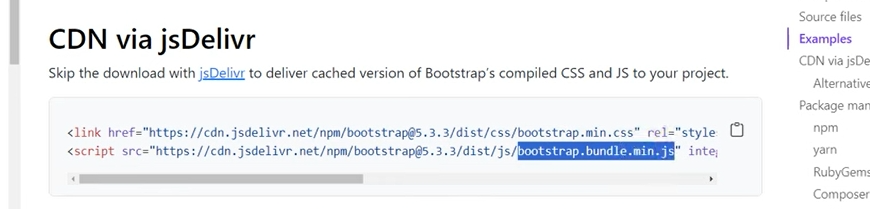
if u want to use offline , download these file to use local
min and bundle min is enough
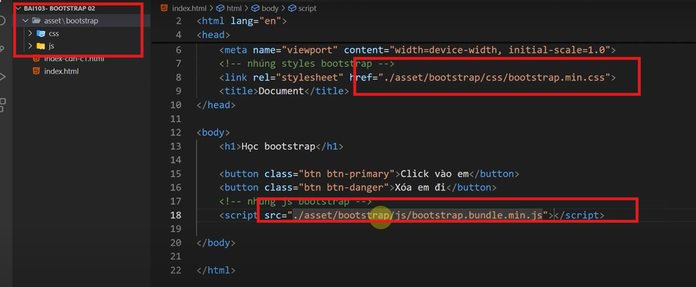

---

button
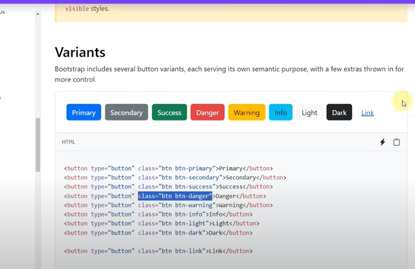

---

background
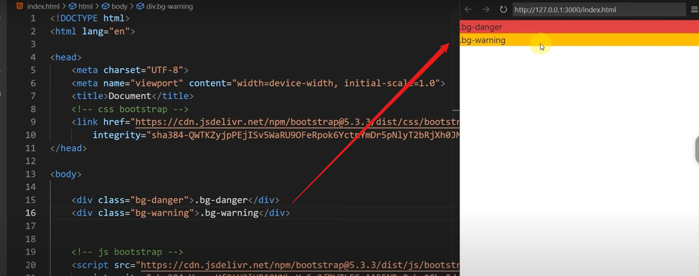
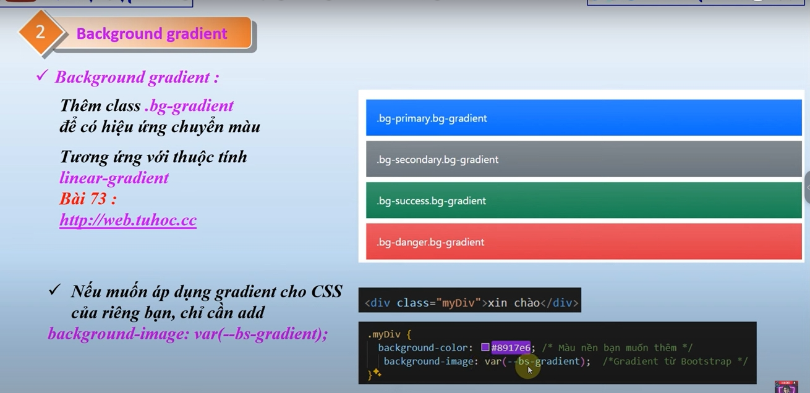
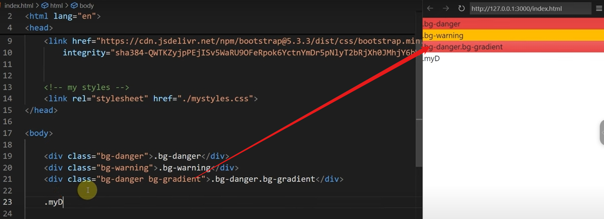
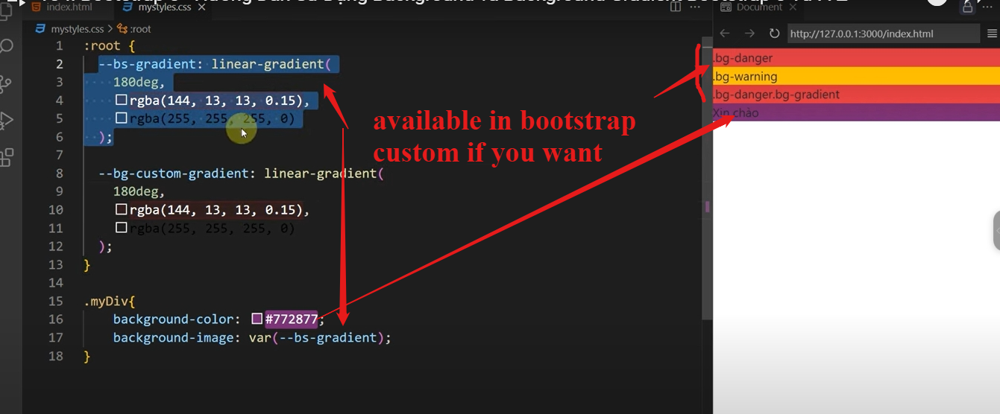

---

text-color-size
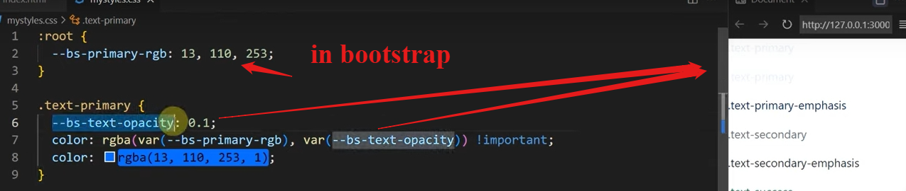
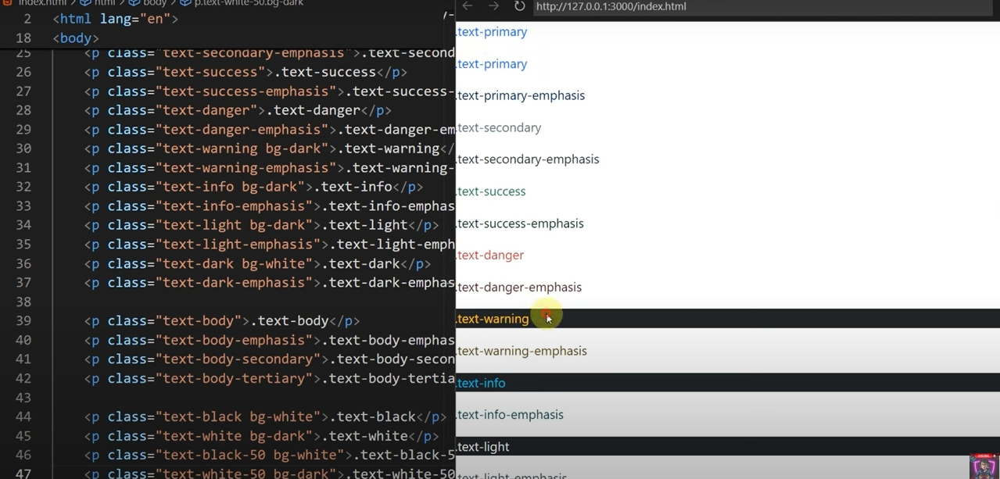
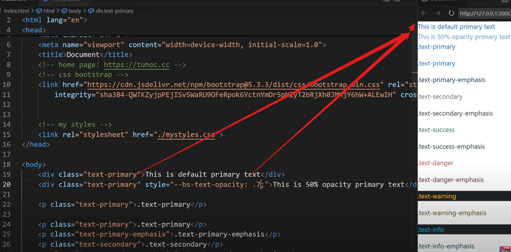
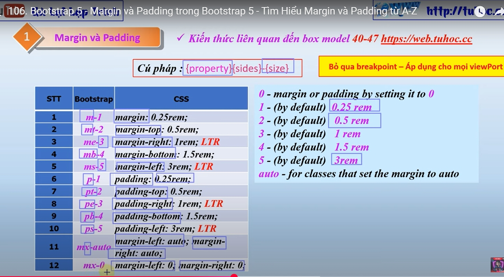
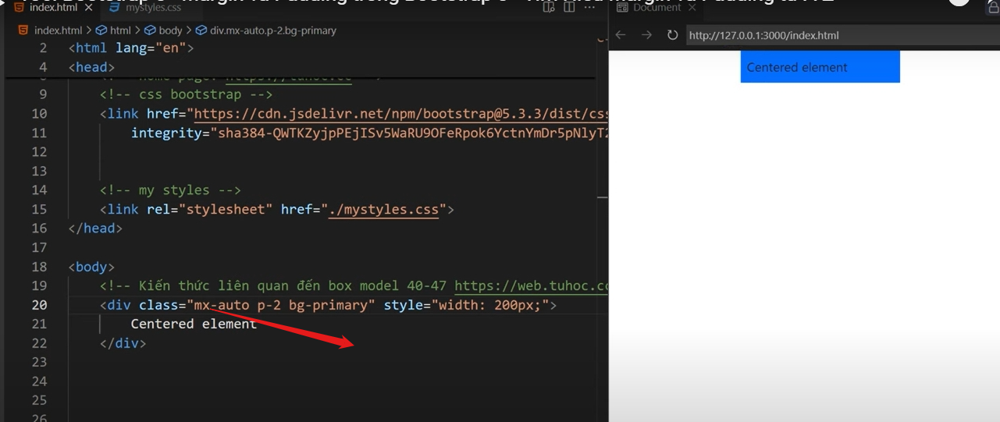
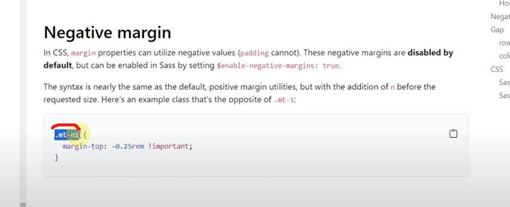
