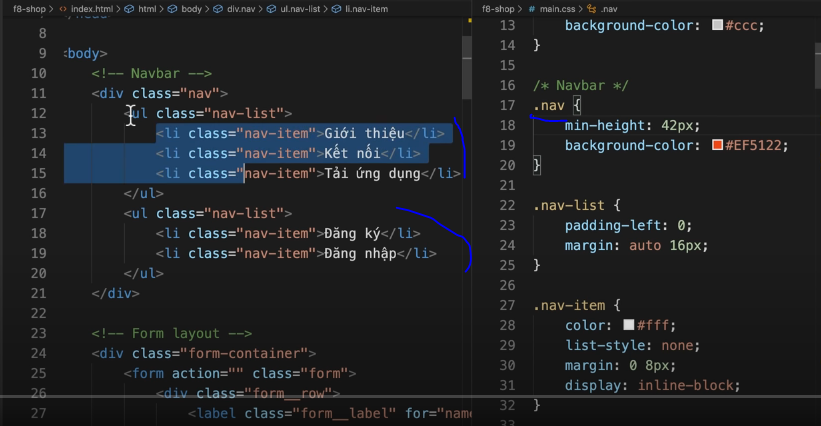

# demo flex box 

- space between 

code đầu 

chuyển sang flex box thì mặc định main axis là row nên 2 items nằm ngang 

chuyển sang space between 

# làm form 

code đầu

thêm flex : không có gì xảy ra do 2 tk cha có 1 con và main axis 

inline flex : làm cho cục cha đó không chiếm hết chiều nganh , chỉ bao quanh bản thân nó nên 2 cái cùng 1 hàng 

thêm flex 1 cho input : do có 1 con nên thằng con nó chiếm hết chiều ngang 

thêm chiều ngang tối thiểu cho chữ nó ấy 

# làm  3 cột từ 3 hàng 

code đầu 

thêm flex . lúc này kích thước chia 3 cột dựa vào nội dung bên trong 

thêm flex 1 cho con 

thấy 3 thằng có cột bằng nhau , do 3 thằng con để 1 thì chia ra 3 cột bằng nhau 

ở dưới thì 2 thằng 1 bé hơn 3 lần thằng giữa 

# làm 3 hàng thành 3 khung nhỏ cách nhau 1 khoảng 

code đầu 

thêm thằng cha flex thì nó ra 