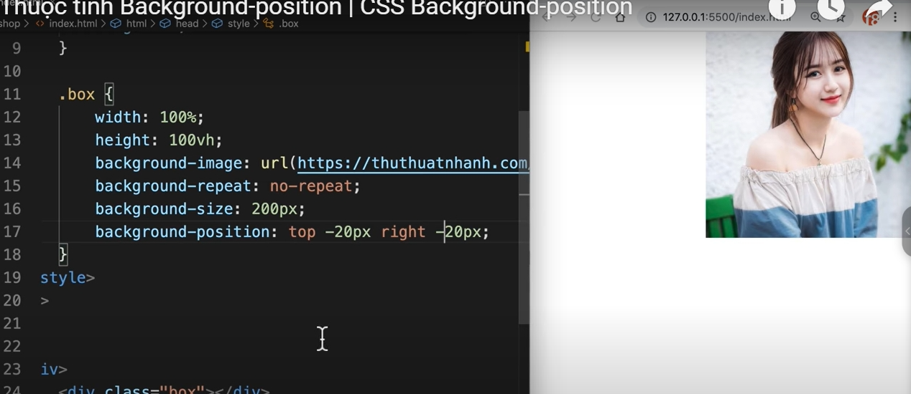

padding

---
border

---
margin 

---

box sizing 

muốn tổng kích thước không bị ảnh hưởng bởi padding , border ... thì dùng box sizing 

như ảnh ở dưới thì dù padding 16px thì tổng vẫn 100px do box-sizing :border-box 
nhưng nếu để to quá thì vẫn bị tràn ra 
còn kiểu content-box thì giống mặc định , unset thì hủy đi border-box ,..

---
background-clip 

---
background-image

chỉ 1 ảnh không lặp 

còn y là dọc 

muốn ảnh mà có màu xen kẽ vô thì dùng rgba trong đó rgb là red green blue , a là từ 0 - 1 độ chỉnh trong suốt 

ảnh mẫu dùng background-size 100% với repeat mà trong đẹp thì 

---
background-size 

lấy đối đa theo chiều dài hoặc dọc sao cho ảnh không bị cắt bớt trong view màn hình  bới so với chiều thực tế 

chấp nhật bị cắt bớt ảnh dùng cover , lấy ảnh lấp toàn màn hình 

---
background-origin 
giống background-clip nhưng áp dụng lấy ảnh đổ vô  thay vì màu nền 

---
background-position 

mặc định là center

---
shortcut image 

màu - ảnh - lặp - vị trí / size (contain , cover )

---
css function 

---
pseudo classes  : lớp giả 

---
pseudo elements 

---
 # position: đi với top left right bottom 

- relative : lấy bản thân làm tọa độ 

so với margin lấy góc trên trái màn hình làm tọa độ  

- absolute : lấy thằng cha làm tọa độ 

cha gần nhất có thuộc tính position thì con tự xem nó là cha 
code : 

ví dụ :

- fixed : lấy nguyên view trình duyệt làm tọa độ , và nó cố định luôn luôn  ở đó 

- sticky: 

---
# flexbox 

