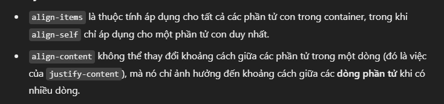
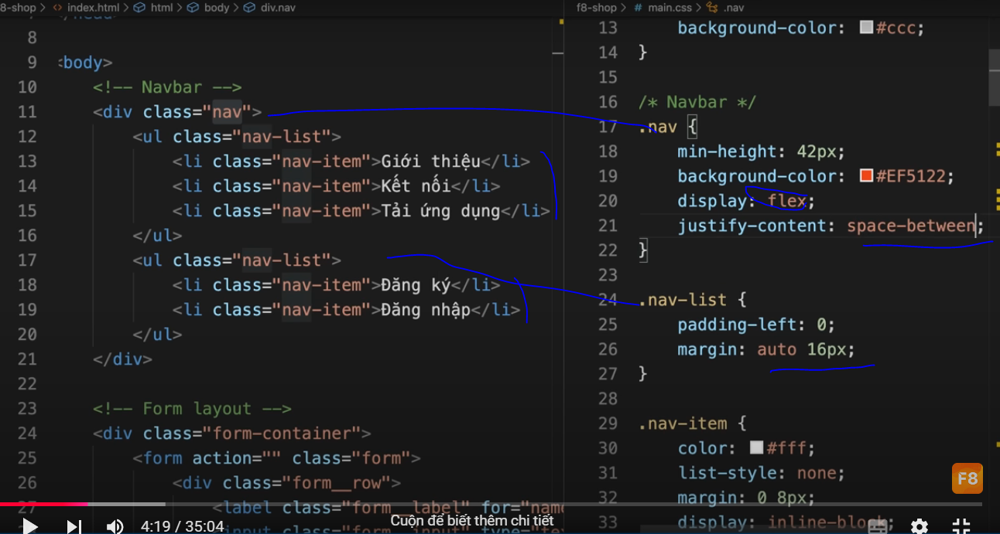
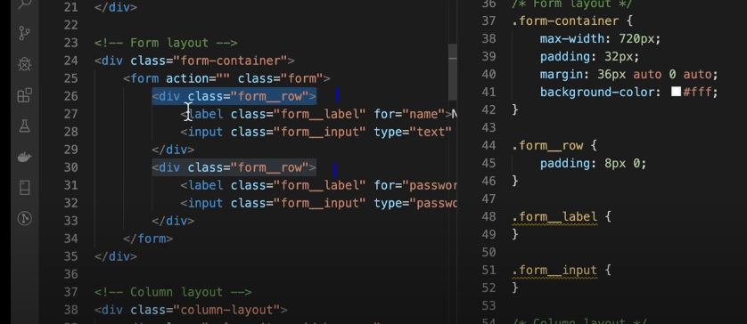
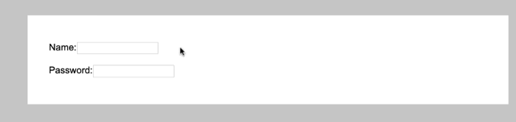
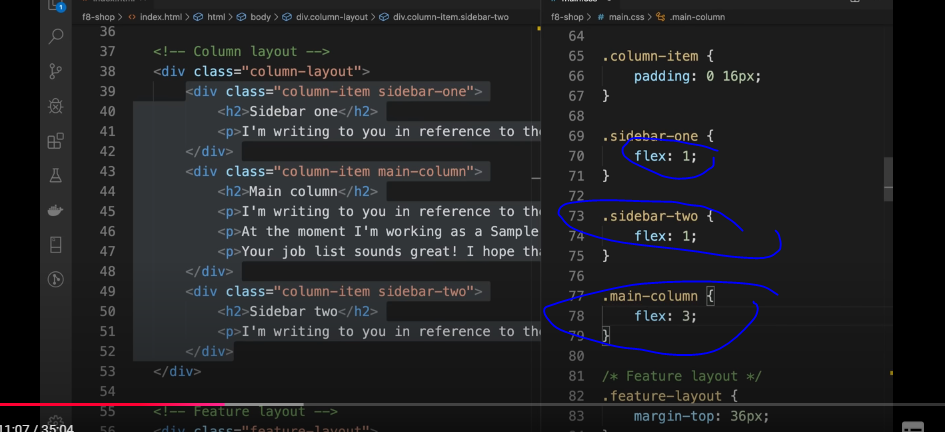
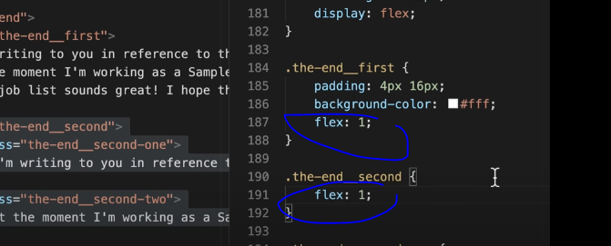

## lưu ý 
trên dưới- trái phải , chiều cross- main mặc định 
dùng flex:... thì mặc định nó theo chỉ số flex-direction là row là main baxis ngang thì nó sẽ chia độ to ngang tỉ lệ tuỳ số 
order cũng thế , bắt đầu từ trái sang phải theo trục baxis 
short hand 

 
test 
https://codepen.io/enxaneta/full/adLPwv/

gọn thì justify content , align items là đủ , align self 
khi con muốn khác biệt , 
align content hơi giống justify content nhưng chỉ dùng được khi wrap và khoảng cách là giữa các dòng khi phần tử trôi xuống 
## -----
just content  là con cách nhau + trái phải  , align items là con trên dưới , self là con muốn tự kỉ trên dưới (align) , align conten đi wrap  hơi giống just content  nhưng con  cách nhau trên dưới 

---
 demo flex box 
#  space between 

code đầu 

chuyển sang flex box thì mặc định main axis là row nên 2 items nằm ngang 

chuyển sang space between 

# làm form 

code đầu

thêm flex : không có gì xảy ra do 2 tk cha có 1 con và main axis 

inline flex : làm cho cục cha đó không chiếm hết chiều nganh , chỉ bao quanh bản thân nó nên 2 cái cùng 1 hàng 

thêm flex 1 cho input : do có 1 con nên thằng con nó chiếm hết chiều ngang 

thêm chiều ngang tối thiểu cho chữ nó ấy 

# làm  3 cột từ 3 hàng 

code đầu 

thêm flex . lúc này kích thước chia 3 cột dựa vào nội dung bên trong 

thêm flex 1 cho con 

thấy 3 thằng có cột bằng nhau , do 3 thằng con để flex 1 thì chia ra 3 cột bằng nhau theo chiều ngang (main) 

ở dưới thì 2 thằng 1 bé hơn 3 lần thằng giữa 

muốn làm cho thứ tự cột khác nhau thì thêm order cho con 

như trên thì con - 1 main 2 thành - 1 2 main 

# làm 3 hàng thành 3 khung nhỏ cách nhau 1 khoảng theo chiều ngang 

code đầu 

thêm thằng cha flex thì nó ra 
thêm flex baxis cho thằng con để chiều  thằng con theo hướng main to ra , mỗi con 30% để 10% còn lại là khoảng cách  , ở đây là ngang  

thêm vo thằng cha space between thì nó sẽ cách nhau ra nhưng 2 bên lề nó cũng k có khoảng trắng 

khi thay bằng space around  : thì khoảng cách trái phải giữa các items bằng nhau 

khi thay bằng space evently   : thì khoảng cách giữa các items bằng nhau 
---
muốn pc thì 3 cột ngang 
đt thì 3 cột dọc 
nghĩa là chiều ngang tối thiểu phải như thế nó mới thực hiện hàm 
nhỏ hơn nó không thực hiện nữa nên nó thành về cột mặc định 

# wrap 

có thể dùng flex rồi space around nhưng nếu kéo màn hình nhỏ lại thì items nó không xuống dòng do mặc định là flex-wrap: nowrap  

thay bằng wrap như dưới là kéo màn hình items nó xuống dòng 

mặc định nó xuống dòng là do cross axis hướng từ trên xuống 
dùng wrap-reverse thì cross từ dưới lên 

# căn giữa item 

flex cha xong margin auto con  

# dọc thành ngang . phần trăm , chuyển động 

- ngoài lề để làm mỗi cột có chiều cao khác nhau thêm thẻ inline chỉnh percent chiều cao 

thêm thằng cha flex 

cha thêm space around 

do cross bắt đầu từ trên xuống nghĩa là bắt đầu từ trên nên ta đổi cho thằng cha  align-items:flex-end  thành end để về cross end 
có thể đổi cho thằng con align-self:flex-end thì nó cũng tương tự 

thêm code sau cho phần con để nó chuyển động từ gì sang gì 
code dưới sẽ chuyển từ 50% đến 100% giá trị của từng thằng 
ví dụ thằng 10% thì sẽ mờ lúc nó bằng 10%-50% = -40% nhưng khi lên tròn đủ 10% lại thì nó hiện lên 

# 1 ông 2 cha , cha 2 con , 1 cột to 2 cột nhỏ 

code đầu 

sau khi cho thằng ông  flex 

cho 2 thằng ba flex 1 để bằng nhau chiều ngang 

cho thằng cha2 flex sau đó 2 thằng con flex 1 để 2 con  bằng nhau theo chiều ngang 

thêm flex-direction : column cho cha2 để 2 thằng con chiều dọc , mà flex:1 cho con  nên 2 con theo chiều dọc bằng nhau 

muốn hồng dưới xanh trên thì cha2 flex-direction : column-reverse , 
muốn trắng (cha1) qua bên phải thì cho ông flex-direction : row-reverse 

