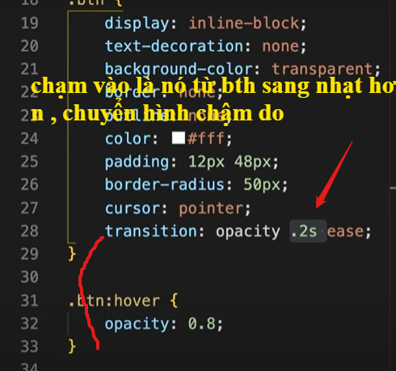

quy chuẩn đặt tên để quản lý code trong team cho dễ không bị lẫn tên nhau 

lab 

outline là sờ vào nó hiện xanh 

làm nút không bấm được 
chạm vô cũng k đổi gì 

bem làm như này kiểu class chức năng rõ ràng rành mạch 

lab2 
https://fontawesome.com

cho top left thằng cha rồi chỉnh như dưới để nó thụt vô hết trong tường 

cho nó hiện lên từ trái qua phải mượt mà trong 0.3s sau đó delay 3s rồi làm mờ trong 1s , nhưng nó sẽ lặp lại vì hết to thì về from , nên ta dùng forwards thì hàm to2 sẽ k chạy nữa  . 

làm nút bấm hiện thông báo như trên ? 

xem đến 20p rồi xem js đi 

