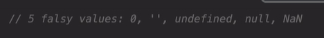
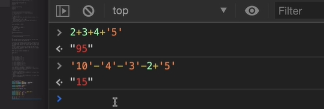
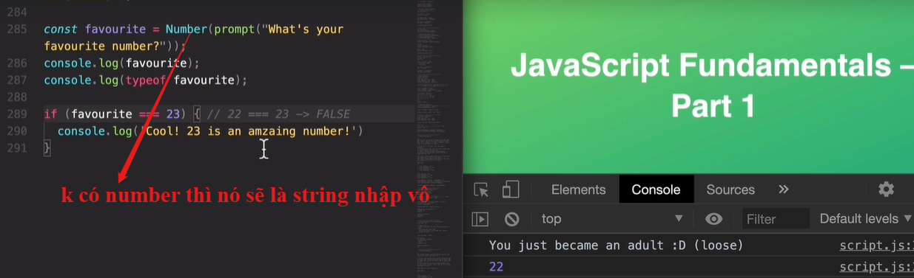
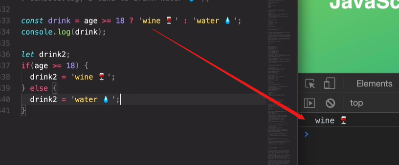
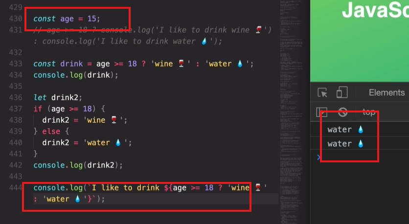
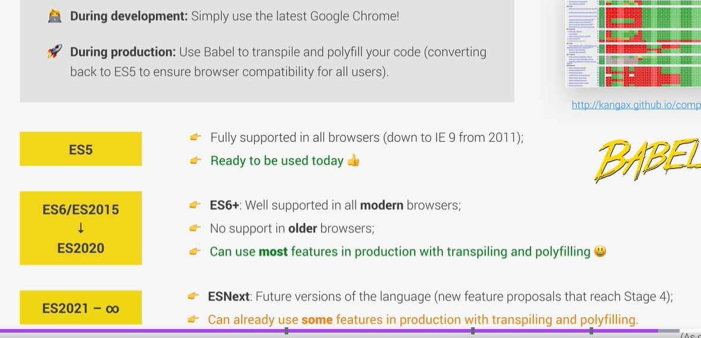

## 

type coercion + will automaticly convert to string - \ \* / is operater


== loose

=== strict , just always use this

### **Kết hợp giữa expression và statement**:

- Trong một câu lệnh, có thể chứa các biểu thức.

  ```python
  x = 2 + 3  # '2 + 3' là expression, còn toàn bộ 'x = 2 + 3' là statement.
  if x > 4:  # 'x > 4' là expression, còn câu lệnh `if` là statement.
      print("Hello")  # Đây là statement.

  ```

- **Expression**: Trả về giá trị (tính toán, so sánh, v.v.).
- **Statement**: Thực hiện hành động (gán giá trị, vòng lặp, điều kiện, v.v.).


console.log cant print the statement like "if else" , but the expression like string , or tenary operator can


dùng babel để transpile code version mới thành cũ để mọi user dùng được web , es6 -> es5

