khi không bật strict mode thì sẽ không biết tại sao lỗi , ở những lỗi như sai tên biến , tên biến là reserve keyword chẳng hạn
nên dùng ở đầu trước mọi code ,  
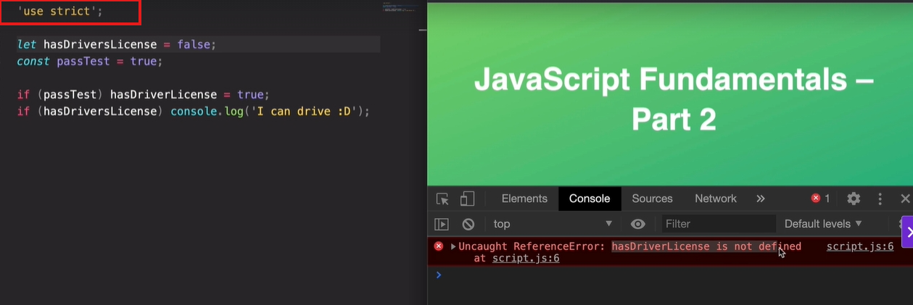

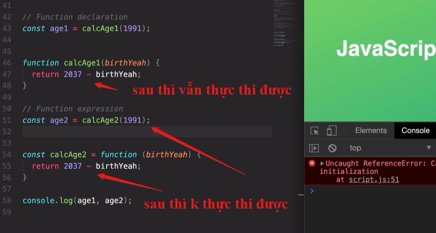
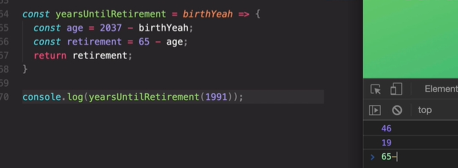
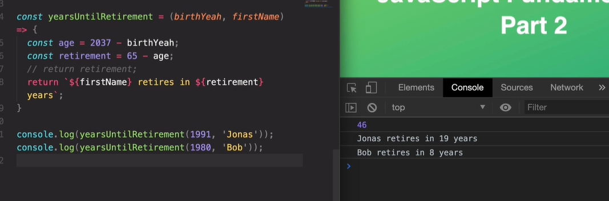
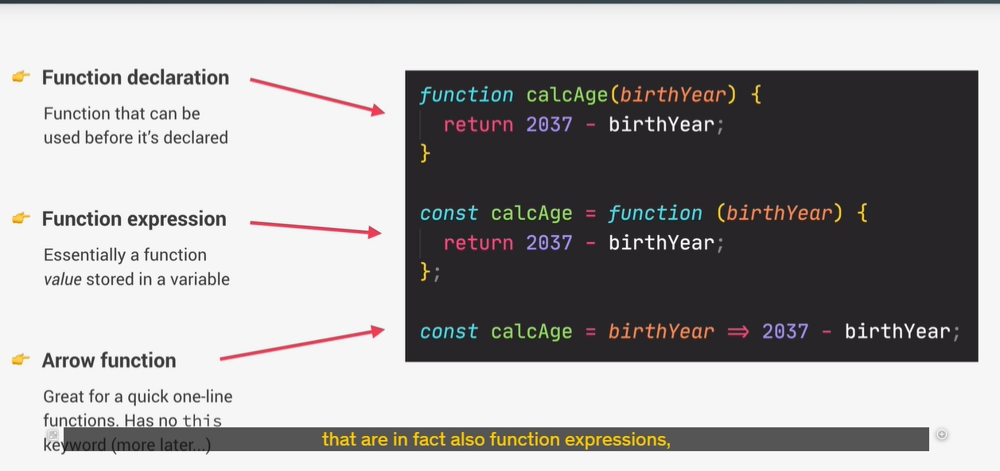
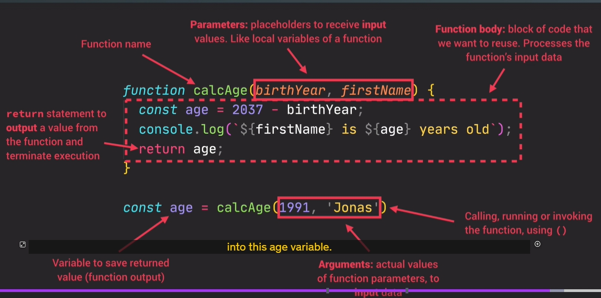
console.log just for dev purpose , print in console for review or check the variable

arr[expression not statement in here ]

declare func is statement but function invocation is expression , so you can use it in arr[func(...),func(...) ]
const arr can change each value but not the whole arr
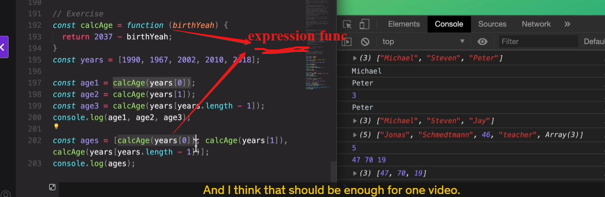
shilf pop - unshilf push
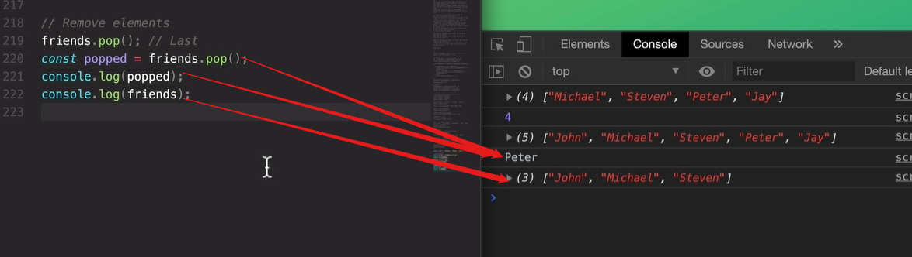
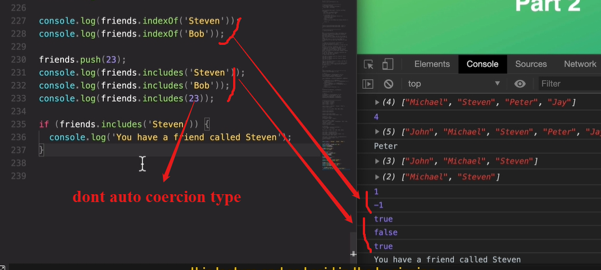
put any expression in [ ]
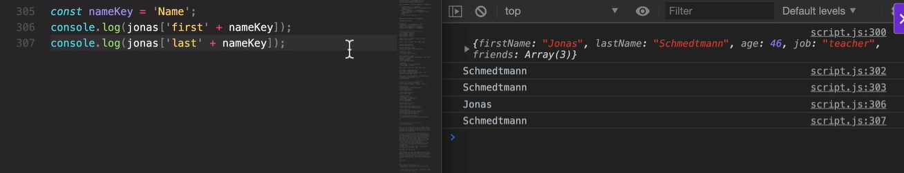
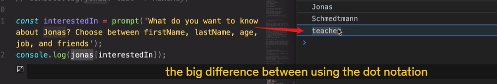
only expression can put in object :
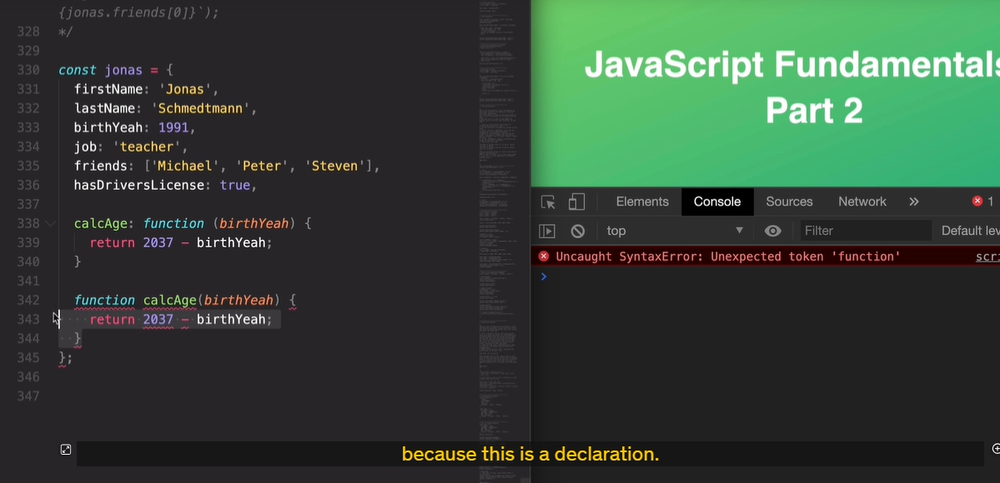
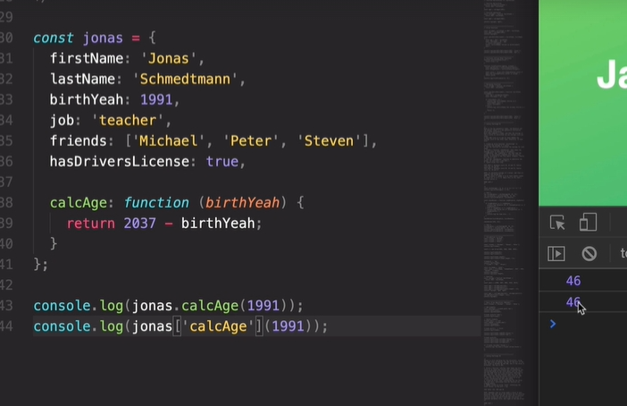
this is the object
when use this.kk it create new property and store the value in that
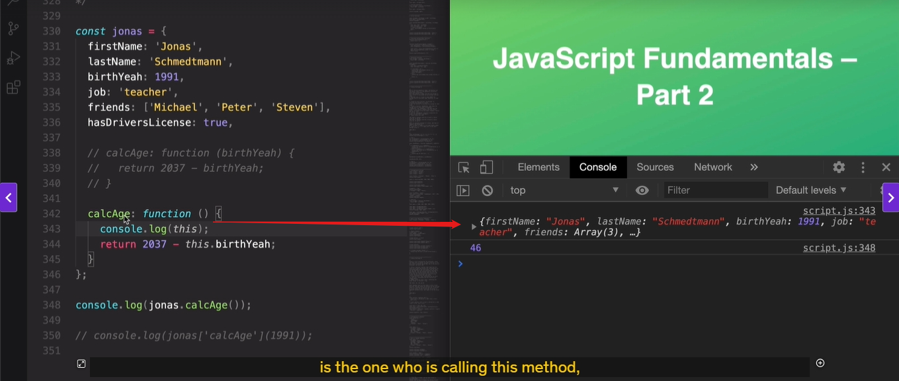
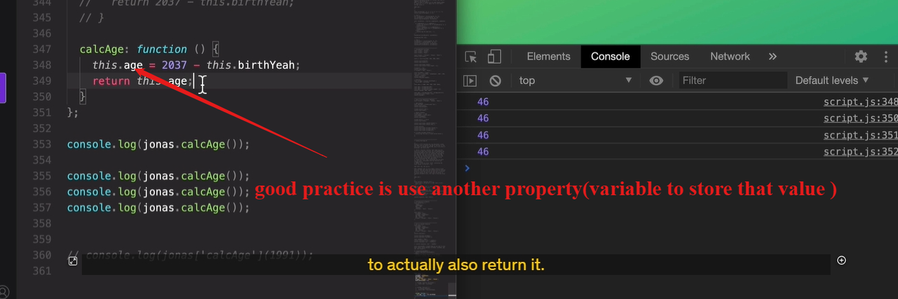
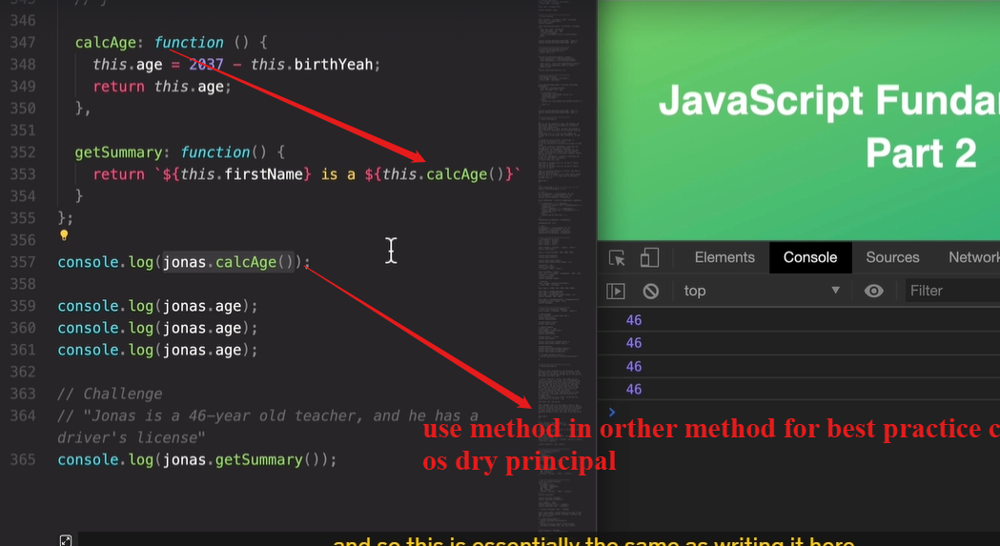
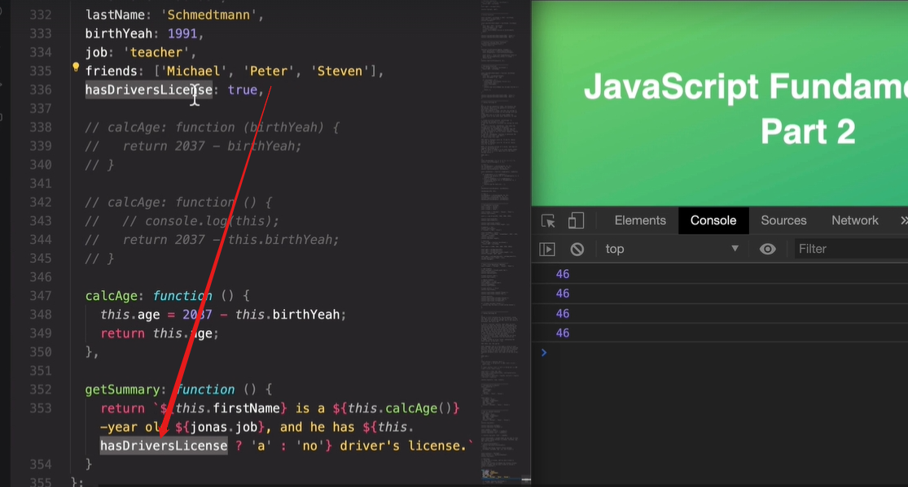
arr is also object .so arr can have object
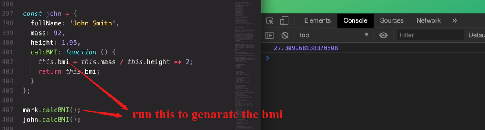

how to think like dev
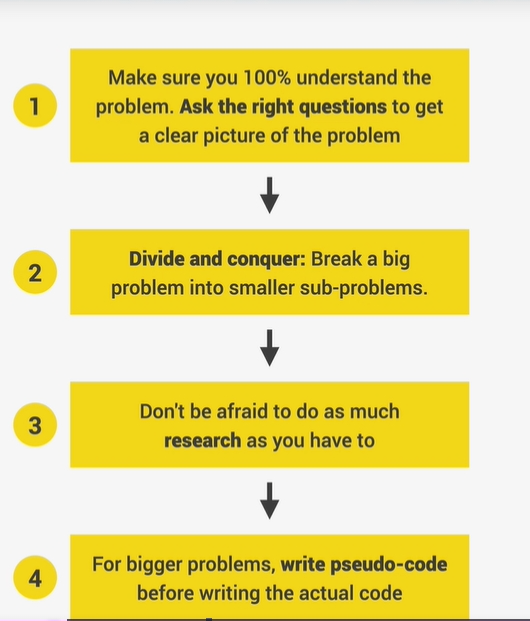
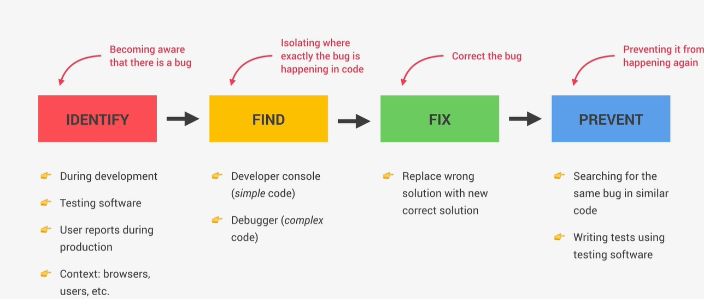
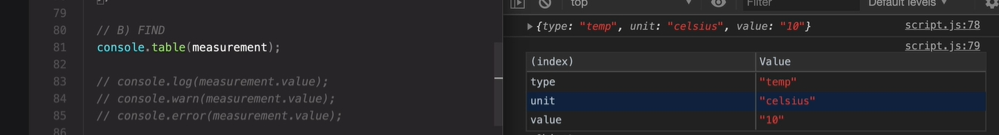
