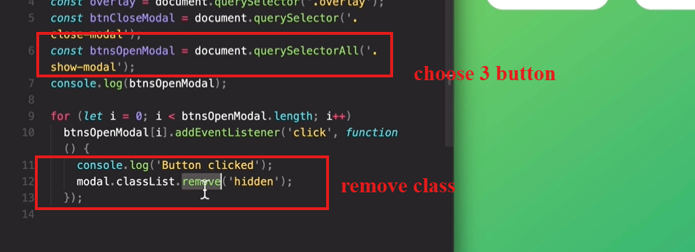

Để mình giải thích lại một cách dễ hiểu hơn nhé!

---

### 1. **DOM là gì?**

- DOM (Document Object Model) giống như **bản đồ của trang web**.
- Khi bạn viết HTML, trình duyệt đọc file HTML và **chuyển đổi nó thành một cây DOM** để JavaScript có thể tương tác được.

---

### . **DOM và JavaScript có liên quan không?**

- **JavaScript** là ngôn ngữ lập trình.
- **DOM** là công cụ (tool) mà trình duyệt cung cấp để JavaScript tương tác với trang web.
- DOM không phải là JavaScript, nhưng bạn dùng JavaScript để thao tác với DOM.

---

### . **Web APIs là gì?**

- Ngoài DOM, trình duyệt cung cấp rất nhiều công cụ khác (gọi là **Web APIs**), ví dụ:
  - **Fetch API:** Dùng để lấy dữ liệu từ server.
  - **Timers:** Dùng để hẹn giờ chạy một đoạn mã.
- Tất cả những thứ này được trình duyệt cung cấp sẵn, bạn chỉ việc dùng mà không cần cài đặt gì thêm.

---

### . **Tóm lại**

- DOM là cấu trúc giúp JavaScript "nói chuyện" với trang web.
- Bạn dùng các lệnh như `document.querySelector` để truy cập hoặc chỉnh sửa các thành phần HTML qua DOM.
- DOM không phải JavaScript, mà là **một công cụ do trình duyệt cung cấp**.

---

func execute when event happen is event handler

math.random create a random number 0 <= x < 1

random \* 20 mean 0 - 19.xxx

