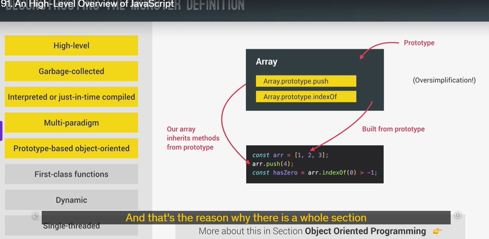

---

js runtime vs engine
computer's prosesser only understant 0 and 1
single-thread : thread is unit that adress by prosesser

### 1. **JavaScript Engine**:

- A **JavaScript engine** is a program that interprets and executes JavaScript code.
- The most famous example of a JavaScript engine is **V8**, created by Google. It powers **Google Chrome** and **Node.js**.
- Every browser has its own engine, but V8 is widely known for its speed and optimization.

### 2. **Components of a JavaScript Engine**:

- **Call Stack**: Where JavaScript code is executed using execution contexts.
- **Heap**: A memory pool that stores objects needed by the application.

### 3. **Compilation vs. Interpretation**:

- **Compilation**: The entire source code is converted into machine code before execution. The machine code is portable and can be executed on any computer.
- **Interpretation**: The interpreter reads and executes code line by line.
- JavaScript used to be interpreted, but modern engines use **Just-in-Time (JIT) Compilation**, which combines both methods. Code is compiled into machine code as it's needed and executed immediately.

### 4. **How JavaScript is Executed**:

- **Parsing**: When JavaScript enters the engine, it is first parsed into a data structure called an **Abstract Syntax Tree (AST)**, which breaks down the code into meaningful components (like keywords, variables, etc.).
- **Compilation**: The AST is then compiled into machine code using JIT compilation.
- **Execution**: The compiled code is executed in the **call stack**.
- **Optimization**: Initially, the machine code may be unoptimized for fast execution. After that, the engine optimizes the code in the background without stopping execution.

### 5. **JavaScript Runtime**:

- A **JavaScript runtime** is a container that includes everything needed to run JavaScript. It contains:
  - The **JavaScript engine**.
  - **Web APIs**: These are functionalities like the DOM, timers, or `console.log` that aren't part of the language itself but are provided to the engine.
  - **Callback Queue**: Stores callback functions (such as event handler functions) that are ready to be executed.
- The **Event Loop** moves callback functions from the callback queue to the call stack when it's empty, enabling **non-blocking concurrency**.

### 6. **Browser vs. Node.js Runtime**:

- In the **browser runtime**, web APIs are available, but in **Node.js** (which runs JavaScript outside of a browser), these APIs are replaced with **C++ bindings** and a **thread pool**.
- Node.js doesn't need the DOM or browser-specific APIs, as it's used for server-side applications.

---

In this lecture, we explored how JavaScript code is executed, focusing on execution contexts, the call stack, and the role of variables and functions in that process.

### Here's a summary of the key points discussed:

1. **Execution Context Creation**:
   - When JavaScript code is ready to execute, a **global execution context** is created for the top-level code (code not inside a function).
   - **Functions** are declared in this context, but their code will not run until they are explicitly called.
2. **What is an Execution Context?**:
   

   - An **execution context** is the environment where a specific piece of JavaScript code is executed. It’s like a "box" that stores everything necessary for execution, such as variables and functions.
   - The analogy given compares the execution context to a **pizza box**—the pizza being the code to execute and the box containing everything needed to run the code.

3. **Global Execution Context**:

   - There is only **one global execution context** in any JavaScript project. This is where top-level code executes and is always present as the default context.
   - When the code inside the global execution context is finished executing, the functions declared at the top level will be executed.

4. **Function Execution Context**:
   

   - When a function is called, a **new execution context** is created for that function.
   - Each function has its own execution context, which contains its **variable environment**, the **arguments object**, and a **scope chain**.
   - The **scope chain** helps functions access variables from their outer contexts.

5. **Call Stack**:
   
   

   - The **call stack** is a critical part of the JavaScript engine that tracks the execution contexts.
   - When a function is called, its execution context is pushed onto the stack, and when the function finishes, the context is popped off the stack.
   - **Only one function** can execute at a time (JavaScript is single-threaded), so the engine keeps track of the current function's execution context by maintaining this stack.

6. **Execution Flow**:

   - The call stack helps determine which function is currently executing and ensures the proper sequence of execution.
   - The execution context of the **global scope** is created first, and the functions will be executed only when called.
   - When functions call other functions, new execution contexts are pushed to the call stack, and when functions finish executing, execution contexts are popped off.

7. **Arrow Functions**:

   - **Arrow functions** do not have their own **arguments object** or **this keyword**. Instead, they inherit these from the nearest **regular function**.

8. **The Creation and Execution Phases**:
   - **Creation Phase**: The JavaScript engine sets up the execution context by preparing the variable environment, scope chain, and the `this` keyword.
   - **Execution Phase**: The actual execution of the code takes place here.

### Example Walkthrough:

- The lecture also included a walkthrough of how the execution context works with an example involving function calls. Each function gets its own execution context, which is pushed onto the stack, and the call stack ensures that the JavaScript engine knows where to continue once a function finishes executing.

### Key Concepts Recap:

- **Execution Context**: An environment where code is executed.
- **Call Stack**: Keeps track of the order of function calls and execution contexts.
- **Global Execution Context**: The default context for the top-level code.
- **Function Execution Context**: Created when a function is called, storing its local variables, arguments, and scope chain.

JavaScript thực thi mã trong các execution context, được quản lý bởi call stack. Khi mã được biên dịch xong, một global execution context được tạo ra để thực thi mã cấp cao nhất- top-level code (không nằm trong function). Sau đó, khi hàm được gọi, mỗi hàm sẽ tạo ra một execution context riêng và được đưa vào call stack.

Call stack theo dõi thứ tự thực thi mã: khi một function kết thúc, execution context của nó sẽ bị "pop" ra khỏi call stack và trả lại quyền điều khiển cho execution context trước đó. Mỗi function hoặc mã cấp cao đều có môi trường biến riêng (variable environment) và sẽ có scope chain để truy cập biến bên ngoài nếu cần.
