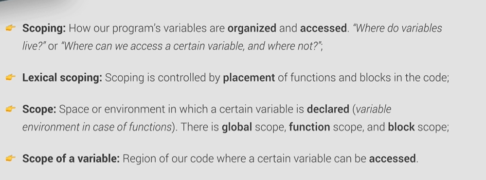
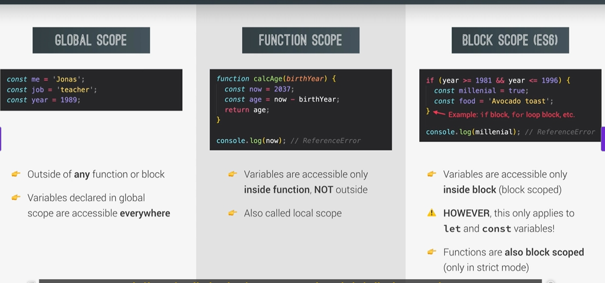
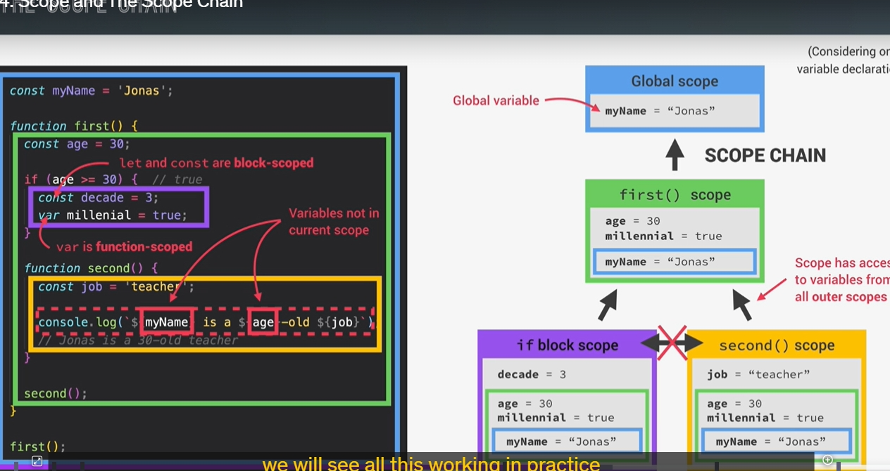
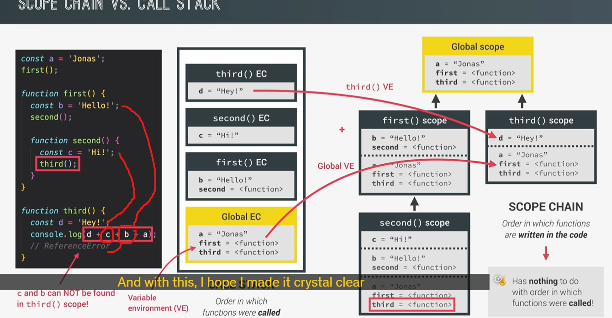
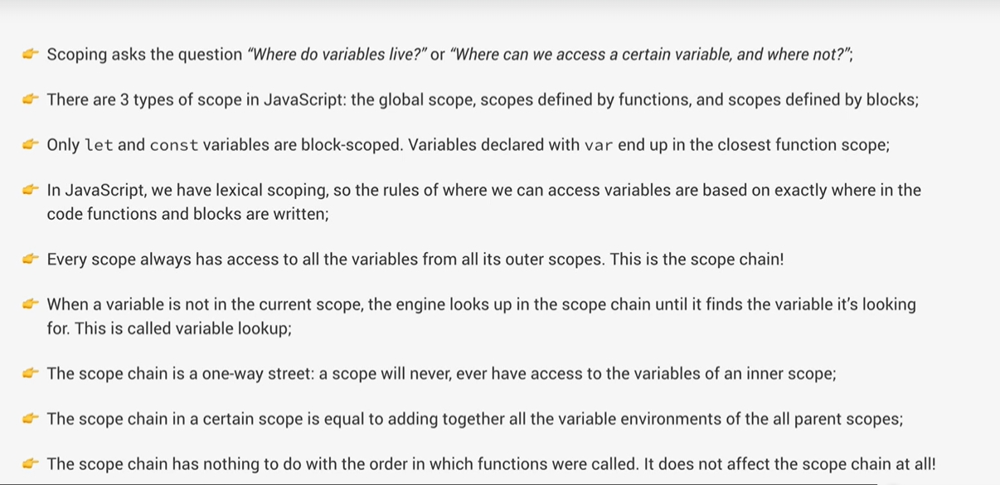

We can also think of the scope chain in a certain scope as being equal to adding together
all the variable environments of all the parent scopes.
Scope chain có thể xem như tổng hợp tất cả các "môi trường biến" (variable environments) từ scope hiện tại cho đến các scope cha.
Khi bạn truy cập một biến trong một hàm (scope hiện tại), JavaScript sẽ tìm biến đó trong phạm vi của chính nó trước.
Nếu không tìm thấy, JavaScript sẽ tiếp tục tìm kiếm trong các phạm vi cha theo thứ tự từ gần nhất đến phạm vi toàn cục (global scope).
